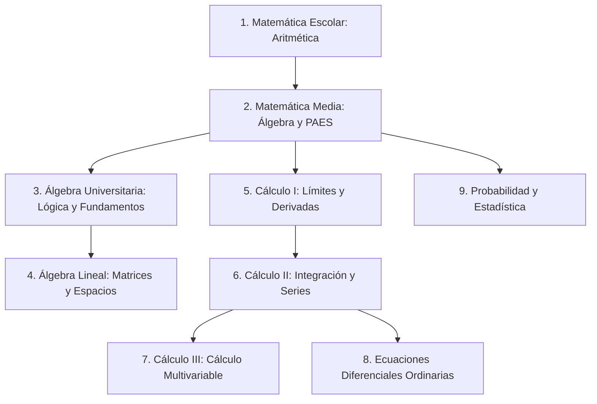
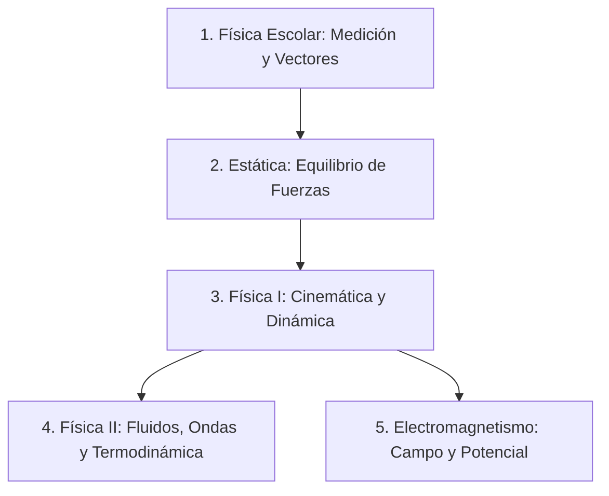
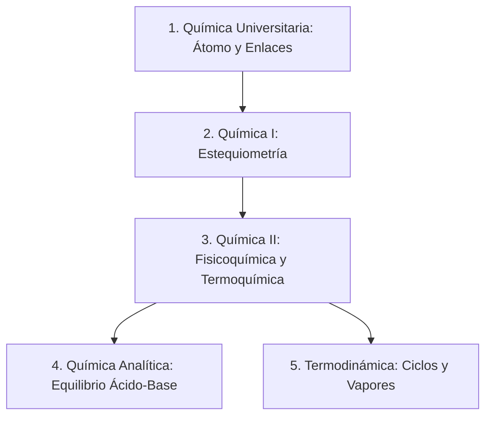

# Reporte Técnico: Auditoría de Gamificación y Malla Curricular Vertebral
**Para: ProfeOnline.cl**
**Fecha:** 2026-06-01
**Autor:** Antigravity (Codex)

---

## 1. Introducción y Objetivos

Este reporte presenta una **auditoría profunda** de la experiencia de usuario (UX) educativa, las mecánicas de gamificación actuales de **ProfeOnline** y el ordenamiento de sus contenidos. El análisis se divide en tres ejes clave:
1. **Auditoría de Gamificación:** Comparativa directa frente a referentes mundiales en tecnología educativa y diseño del comportamiento: **Khan Academy** (dominio de destrezas/mastery learning) y **Duolingo** (retención/loops de hábito).
2. **Pedagogía en Ciencias y Matemáticas:** Estándares didácticos para la enseñanza digital de áreas STEM (ciencias, tecnología, ingeniería y matemáticas), evaluando el scaffolding conceptual.
3. **Malla Curricular Vertebral:** Reorganización estructurada de los contenidos actuales de la base de datos de ProfeOnline en **Matemática, Física y Química**, clasificando el flujo idóneo de aprendizaje desde el nivel escolar básico hasta el universitario.

---

## 2. Auditoría Comparativa de Gamificación

ProfeOnline ya posee un motor técnico de gamificación en Django (`apps/content/models/gamification.py` y `evaluation.py`) que soporta eventos de XP, rachas, habilidades/skills desbloqueables y tres niveles de evaluación por recurso. A continuación se audita este motor frente a las mejores prácticas internacionales.

### 2.1. Duolingo vs. ProfeOnline: El Loop de Hábito y Retención

Duolingo basa su éxito en el **diseño del comportamiento (Octalysis Framework)**, enfocándose en la retención diaria y el enganche extrínseco.

| Dimensión | Duolingo | ProfeOnline (Estado Actual) | Diagnóstico y Brecha |
| --- | --- | --- | --- |
| **La Racha (Streak)** | El eje de retención. Se protege con "Protectores de Racha" (monetización/gemas) y alertas push personalizadas antes de que acabe el día. | Almacenada en `UserStreak` (conteo actual y récord). Sin embargo, carece de exposición visual constante y notificaciones proactivas. | **Brecha de Visibilidad:** La racha existe en el modelo pero el usuario no siente la urgencia o el orgullo de mantenerla porque no se destaca en el Home o el Perfil de manera interactiva. |
| **Loops de Feedback** | Inmediato y lúdico. Cada respuesta correcta suena con un tono agudo de éxito y animaciones rápidas. Las respuestas erróneas cuestan "vidas/corazones". | Retroalimentación en el formulario de Quiz por HTMX. Registro de respuestas correctas e incorrectas con explicaciones estáticas. | **Falta de Micro-interacción:** La respuesta es funcional, pero carece de dinamismo (sonidos sutiles, confeti al aprobar un nivel 3, o animaciones de superación). |
| **Mecánicas Sociales** | Ligas semanales (Bronce a Diamante) donde los usuarios compiten por XP en grupos de 30 personas. | Eventos de XP modelados (`XPEvent`) asociados a prácticas, niveles y evaluaciones de temas. | **Aislamiento Social:** El XP solo se acumula individualmente. No hay comparación con pares, tablas de clasificación (Leaderboards) ni metas comunitarias. |

### 2.2. Khan Academy vs. ProfeOnline: Aprendizaje Basado en el Dominio (Mastery Learning)

Khan Academy se orienta a la **comprensión conceptual profunda**. Su objetivo no es el entretenimiento rápido, sino asegurar que el estudiante no avance con vacíos de aprendizaje.

| Dimensión | Khan Academy | ProfeOnline (Estado Actual) | Diagnóstico y Brecha |
| --- | --- | --- | --- |
| **Scaffolding de Destrezas** | Nivel de dominio incremental: *Intento -> Familiar -> Competente -> Dominado*. El nivel "Dominado" solo se obtiene en pruebas globales acumulativas. | Estructurado en 3 niveles de recurso: *1. Conceptos, 2. Ejercicios simples, 3. Problemas de aplicación*. | **Progresión Desbloqueada:** El usuario puede intentar el Nivel 3 (problemas de aplicación) directamente sin haber aprobado el Nivel 1. Esto puede provocar frustración si no domina la base. |
| **Evaluaciones Síntesis** | Pruebas de unidad y "Desafíos de Curso" que mezclan preguntas de distintos temas de forma aleatoria para fomentar la retención a largo plazo. | Evaluaciones de Tema (`TopicEvaluationAttempt`) que sintetizan las preguntas de los recursos de un mismo tema. | **Excelente Base Técnica:** El modelo de evaluación de temas es sólido y es lo más cercano al Mastery de Khan Academy en ProfeOnline. Falta explotar el desbloqueo de `UserSkill`. |
| **Pizarra de Apoyo** | Incorpora un espacio para dibujar/escribir sobre la pantalla mientras se resuelve un ejercicio (fundamental en tablets/móviles para STEM). | Interfaz de quiz limpia en texto con opciones múltiples. | **Dependencia de Lápiz y Papel:** Obliga al alumno a resolver fuera de la pantalla. Un lienzo digital integrado enriquecería la resolución de fórmulas de física/química. |

---

## 3. Estándares Educativos para Ciencias y Matemáticas (STEM)

Enseñar ciencias exactas de forma digital requiere un enfoque diferente a los idiomas o las humanidades. No se trata de memorizar, sino de **desarrollar modelos mentales y habilidades procedimentales**.

### 3.1. Las Tres Capas del Scaffolding Pedagógico
ProfeOnline clasifica sus evaluaciones en tres niveles pedagógicos muy acertados. Para alcanzar la excelencia didáctica, se debe asegurar el siguiente estándar de contenido en cada nivel:

1. **Nivel 1: Conceptos (Anclaje Cognitivo)**
   - *Didáctica:* Evaluar concepciones erróneas comunes (misconceptions). En física, por ejemplo, confundir velocidad con aceleración, o en química, confundir enlaces covalentes con iónicos.
   - *Khan Academy benchmark:* Preguntas conceptuales con diagramas interactivos o identificación de fórmulas correctas.
2. **Nivel 2: Ejercicios Simples (Automatización de Algoritmos)**
   - *Didáctica:* Práctica repetitiva con variación de variables. El estudiante aprende el algoritmo de resolución (ej. balancear una ecuación química o resolver una derivada por regla de la cadena).
   - *Duolingo benchmark:* Ejercicios rápidos con retroalimentación correctiva instantánea.
3. **Nivel 3: Problemas de Aplicación (Razonamiento Complejo)**
   - *Didáctica:* Problemas contextualizados de la vida real o enunciados científicos complejos sin estructura explícita (ej. calcular el tiempo de encuentro de dos vehículos acelerando, o un problema de optimización en cálculo).
   - *Khan Academy benchmark:* Requiere múltiples pasos de resolución y la integración de conceptos previos.

### 3.2. El Valor Pedagógico del Error
En matemáticas y ciencias, el error no es una penalización; es la principal fuente de aprendizaje.
- **Resoluciones paso a paso (Spaced Explanations):** Al fallar una pregunta de Nivel 2 o 3, la plataforma no debe limitarse a mostrar cuál era la alternativa correcta. Debe desglosar la resolución matemática paso a paso (fórmulas aplicadas, simplificaciones y resultado).
- **Análisis de Distractores:** Las alternativas incorrectas en un quiz de ciencias no deben ser números al azar. Deben corresponder a errores procedimentales típicos (ej. olvidar cambiar el signo de una ecuación o sumar mal los denominadores). Al elegir un distractor, el feedback debe indicarle al estudiante: *"Parece que sumaste directamente los denominadores sin calcular el Mínimo Común Múltiplo. Recuerda que..."*.

---

## 4. Malla Curricular y Estructura Vertebral de Contenidos

Para guiar de manera eficiente a un estudiante en su proceso de aprendizaje (ya sea escolar, de preparación PAES o universitario), los contenidos deben seguir una **secuencia lógica de prerrequisitos cognitivos**.

A continuación, se presenta la propuesta de la **Estructura Vertebral** para ordenar y jerarquizar los temas actuales y recomendados del sitio en las tres áreas clave.

### 4.1. Vertebración del Área de Matemática

#### Malla Detallada de Matemática (Progreso Lógico)

| Orden Lógico | Nivel Educativo | Asignatura | Temas Clave (Actuales y Recomendados) | Prerrequisito |
| --- | --- | --- | --- | --- |
| **1** | Escolar | Matemática Escolar | - Números Enteros (recta, orden, adición/sustracción) - Números Racionales (decimales a fracción, operaciones) - Proporcionalidad Directa e Inversa | Ninguno |
| **2** | Media | Matemática Media | - Expresiones Algebraicas (polinomios, factorización) - Ecuaciones de 1er y 2do grado - Preparación PAES (geometría, datos y azar) | Matemática Escolar |
| **3** | Universitario | Álgebra (Introducción) | - Lógica Matemática y Proposicional (tablas de verdad) - Teoría de Conjuntos y Demostraciones - Inducción Matemática y Teorema del Binomio | Matemática Media |
| **4** | Universitario | Álgebra Lineal | - Matrices, Determinantes y Sistemas de Ecuaciones - Espacios Vectoriales e Independencia Lineal - Transformaciones Lineales, Valores y Vectores Propios | Álgebra (Intro) |
| **5** | Universitario | Cálculo I | - Límites y Continuidad (indeterminaciones) - Derivadas y Reglas de Derivación - Aplicaciones de la Derivada (Optimización, Tasas) | Matemática Media |
| **6** | Universitario | Cálculo II | - Integrales y Técnicas de Integración (Partes, Sustitución) - Aplicaciones de la Integral (Área, Volumen de Sólidos) - Sucesiones y Series de Potencias | Cálculo I |
| **7** | Universitario | Cálculo III | - Funciones de Varias Variables, Derivadas Parciales y Gradiente - Optimización Multivariable (Multiplicadores de Lagrange) - Integrales Múltiples (Dobles y Triples en coordenadas polares/cilíndricas/esféricas) | Cálculo II |
| **8** | Universitario | EDO | - EDO de 1er orden (variables separables, lineales) - EDO lineales de orden superior (coeficientes constantes) - Transformada de Laplace y Sistemas de EDO | Cálculo II |
| **9** | Universitario | Estadística | - Probabilidad y Estadística Descriptiva (variables aleatorias) - Distribuciones de Probabilidad (Binomial, Normal, t-Student) - Inferencia Estadística e Intervalos de Confianza | Matemática Media |

---

### 4.2. Vertebración del Área de Física

En Física, la comprensión depende estrictamente de las herramientas matemáticas desarrolladas (Álgebra, Trigonometría y Cálculo).

#### Malla Detallada de Física (Progreso Lógico)

| Orden Lógico | Nivel Educativo | Asignatura | Temas Clave (Actuales y Recomendados) | Prerrequisito Matemático |
| --- | --- | --- | --- | --- |
| **1** | Escolar / Media | Física Escolar | - Unidades de medida y análisis dimensional - Vectores en 2D y 3D (componentes, producto punto/cruz) | Álgebra básica, Trigonometría |
| **2** | Universitario | Estática | - Fuerzas, Vectores y Momento (Torque) - Equilibrio de partículas y de cuerpos rígidos | Física Escolar, Álgebra Lineal |
| **3** | Universitario | Física I (Mecánica) | - Cinemática y análisis del movimiento (MRU, MRUA, Proyectiles) - Dinámica de partículas (Leyes de Newton) - Trabajo, Energía y conservación de la Energía | Cálculo I, Física Escolar |
| **4** | Universitario | Física II (Fluidos & Ondas) | - Mecánica de Fluidos y Continuidad (Bernoulli, Arquímedes) - Oscilaciones y Ondas mecánicas - Termodinámica básica (temperatura, calor) | Cálculo II, Física I |
| **5** | Universitario | Electromagnetismo | - Campo Eléctrico y Potencial (Ley de Coulomb, Gauss) - Capacitancia, Resistencia y Circuitos de Corriente Continua - Campo Magnético (Ley de Biot-Savart, Faraday) | Cálculo III, Física I |

---

### 4.3. Vertebración del Área de Química

Química progresa desde la estructura atómica microscópica hacia las reacciones macroscópicas, el equilibrio químico, y finalmente la cuantificación analítica.

#### Malla Detallada de Química (Progreso Lógico)

| Orden Lógico | Nivel Educativo | Asignatura | Temas Clave (Actuales y Recomendados) | Prerrequisito |
| --- | --- | --- | --- | --- |
| **1** | Universitario | Química Universitaria | - Estructura de la materia y Modelos Atómicos - Tabla Periódica y Propiedades Periódicas - Enlaces Químicos (Covalente, Iónico, Metálico) | Ninguno |
| **2** | Universitario | Química I | - Nomenclatura Química Inorgánica - Estequiometría y Balance de Reacciones - Disoluciones Químicas (Molaridad, Molalidad, dilución) | Química Universitaria, Álgebra básica |
| **3** | Universitario | Química II (Fisicoquímica) | - Termoquímica: Entalpía, Entropía y Energía Libre de Gibbs - Cinética Química y Leyes de Velocidad - Equilibrio Químico y Principio de Le Chatelier | Química I, Cálculo I |
| **4** | Universitario | Química Analítica | - Equilibrio Ácido-Base, pH y constante de ionización ($K_a$, $K_b$) - Volumetría y titulaciones de neutralización - Equilibrio de solubilidad y Gravimetría | Química II, Álgebra básica |
| **5** | Universitario | Termodinámica (Física-Química) | - Leyes de la Termodinámica y Trabajo Térmico - Ciclos de potencia, Líquidos y Vapores (Ciclo de Carnot, Rankine) | Química II, Cálculo II |

---

## 5. Recomendaciones de Implementación para ProfeOnline

Para transformar este diagnóstico en características reales dentro del software, se proponen las siguientes líneas de desarrollo tecnológico:

### 5.1. Bloqueo de Progreso (Scaffolding Mandatorio)
- **Idea:** Impedir que el estudiante intente el Nivel 2 o 3 de un recurso si no ha aprobado el nivel inmediatamente anterior.
- **Implementación técnica:** En la vista de Quiz (`apps/content/views/quiz.py`), validar que el usuario cuente con un `QuizAttempt` aprobado (`passed=True`) para el `level - 1` de ese recurso antes de procesar el inicio del nuevo nivel. De lo contrario, retornar una respuesta HTML indicando el bloqueo.

### 5.2. Gamificación del Loop Diario (Streaks Activos)
- **Idea:** Duolinguizar la racha de aprendizaje para mejorar la retención del estudiante.
- **Implementación técnica:**
  1. Mostrar un widget del fuego de la racha (`UserStreak.current_count`) en la cabecera (`navbarMenu`) al lado del nombre del usuario.
  2. Implementar un Middleware de Racha que, tras el login del usuario o al completar su primera práctica del día, evalúe y actualice la fecha (`last_activity_date`). Si el usuario mantiene la racha, disparar un micro-banner motivacional. Si está a punto de perderla, enviarle un recordatorio por correo electrónico (usando la API HTTP de Brevo integrada).

### 5.3. Visualización de la Malla (Skill Tree)
- **Idea:** Que la página de niveles y asignaturas no sea solo un listado plano, sino un "Árbol de Habilidades" (estilo Duolingo) donde los temas bloqueados se muestren en gris y se vayan coloreando a medida que se desbloquean las `UserSkill` de cada tema.
- **Implementación técnica:** Modificar el template `level_detail.html` para renderizar el árbol de temas. Utilizar las relaciones del modelo `UserSkill` en el contexto para verificar qué temas han sido completados con éxito y cuáles requieren prerrequisitos.

### 5.4. Explicaciones del Error Dinámicas
- **Idea:** Almacenar explicaciones matemáticas paso a paso y ligarlas a los resultados incorrectos.
- **Implementación técnica:** Extender el modelo `Question` para soportar explicaciones Markdown ricas en fórmulas (usando notación LaTeX y un renderizador liviano en el frontend como KaTeX). Al fallar el intento de evaluación, renderizar dinámicamente la resolución paso a paso para consolidar el aprendizaje del alumno.
