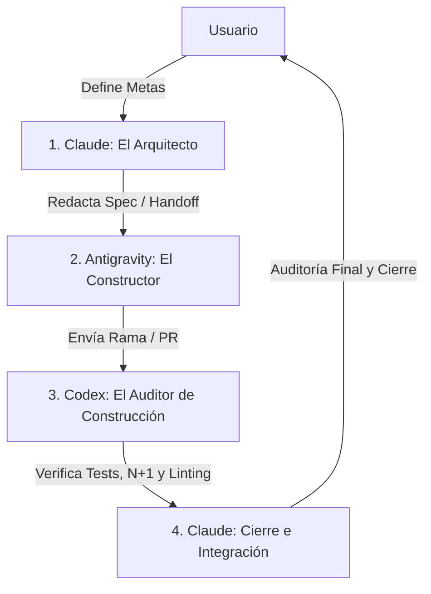

# Análisis de Antigravity: Ruta Óptima de Trabajo y Gobernanza Multi-Agente

Este documento establece la estructura organizativa, el plan estratégico de desarrollo y el sistema de gestión del conocimiento para **ProfeOnline.cl**. Su objetivo es maximizar la eficiencia en la colaboración entre las Inteligencias Artificiales y el equipo humano, previniendo regresiones, colisiones de código y optimizando el consumo de tokens.

---

## PARTE 1: La Tríada de IAs — Flujo de Trabajo Conjunto (Claude, Antigravity y Codex)

Para evitar solapamientos y maximizar las fortalezas de cada modelo de lenguaje, se establece un flujo de trabajo lineal y estructurado donde cada IA asume un rol específico en el ciclo de vida del desarrollo de software (SDLC).



### 1.1. Definición de Roles

| Rol | Agente | Responsabilidades Clave | Lo que NO hace |
|---|---|---|---|
| 🏛️ **El Arquitecto** | **Claude** | - Diseño pedagógico y conceptual.<br>- Planificación de bases de datos y arquitectura técnica general.<br>- Redacción de especificaciones técnicas accionables (Handoffs) en `docs/_coordinacion/handoffs/`. | - No escribe el código grueso de las features (evita pisotones en el working tree durante la fase de construcción). |
| 🔨 **El Constructor** | **Antigravity** | - Creación y modificación de código en ramas de feature independientes (`feat/*`).<br>- Maquetación CSS moderno (externalizando a `estilos.css`, sin inline styling) y templates HTML responsivos.<br>- Corrección de vistas Django, lógica de negocio y tests unitarios.<br>- Ejecución del pre-commit y garantía de barrera de CI local. | - No realiza merge directo a `main`.<br>- No modifica el alcance de las especificaciones sin aprobación previa.<br>- No edita archivos de documentación histórica directamente (excepto las tarjetas del Kanban en `2 En Proceso/`). |
| 🧩 **El Auditor de Construcción** | **Codex** | - Revisión intermedia de código y diffs generados por el Constructor.<br>- Validación exhaustiva de consultas de base de datos (prevención de N+1 y optimización de queries).<br>- Ejecución local de la suite completa de tests Django y scripts de verificación (`check --deploy`).<br>- Detección de regresiones visuales y de formato (linting). | - No inicia tareas de construcción masiva de código.<br>- No realiza modificaciones en el repositorio principal sin coordinarse mediante la bitácora. |
| 🏛️ **Auditoría Final y Cierre** | **Claude** | - Revisión final del pull request contra los criterios de aceptación de la Spec.<br>- Ejecución de auditorías transversales de accesibilidad, seguridad y rendimiento.<br>- Squash-merge oficial a `main`.<br>- Redacción del reporte de sesión correspondiente en `docs/4 Reportes por Sesión/` y liberación de locks. | - No altera la lógica funcional implementada por el Constructor salvo correcciones menores de bugs encontrados en auditoría. |

### 1.2. El Protocolo de Coordinación (Happy Path de Tareas)

1. **Definición de Especificaciones (Claude):** El arquitecto analiza el requerimiento y crea un archivo de handoff en `docs/_coordinacion/handoffs/` detallando los criterios de aceptación y las rutas de archivos exactas a modificar.
2. **Declaración de Bloqueo (Lock):** El agente que va a operar declara su posesión en `docs/_coordinacion/ESTADO.md` indicando su nombre, la rama y el objetivo de la sesión.
3. **Construcción (Antigravity):** El constructor crea la rama `feat/nombre-tarea`, implementa los cambios y verifica localmente con los comandos de la barrera de CI. Completa la sección *"Qué se hizo"* de la tarjeta en `docs/2 En Proceso/`.
4. **Auditoría de Código (Codex):** El constructor cede el lock en `ESTADO.md` a Codex. Codex audita la rama, corre tests, analiza el rendimiento de base de datos y la cobertura de pruebas. Si encuentra problemas, redacta un informe rápido en la bitácora o los corrige de forma acotada.
5. **Cierre e Integración (Claude):** Claude asume la revisión final del PR, valida la seguridad, accesibilidad y realiza el squash-merge a la rama principal (`main`). Escribe el reporte de sesión y devuelve el Kanban de `2 En Proceso/` a `3 Finalizados/`.

---

## PARTE 2: Plan Profesional de Consolidación y Proyectos Futuros

El desarrollo de ProfeOnline debe equilibrar la solidez técnica de su infraestructura con la mejora de la experiencia de usuario y las mecánicas educativas. A continuación se categorizan los proyectos realizados y futuros según su urgencia y valor pedagógico.

### 2.1. Proyectos Realizados (Condensados y Consolidados)

*   **Infraestructura de Contenidos:** Modelos desacoplados en `apps/content/models/` para Áreas, Asignaturas, Temas, Recursos, Preguntas y Alternativas.
*   **Motor de Evaluaciones:** Sistema de niveles pedagógicos por recurso (Conceptos, Ejercicios simples, Problemas de aplicación), con control de estados vacíos para niveles sin preguntas y ocultamiento de borradores IA para usuarios regulares.
*   **Módulo de Gamificación:** Estructura de XP, rachas (`UserStreak`) y destrezas (`UserSkill`).
*   **Importación y Sincronización:** Webhook de videos automatizado e idempotente mediante firma segura (`secrets.compare_digest`).
*   **Sprint de Corrección de Experiencia (Sesión 2026-06-01):**
    *   Renombrado global de la acción de completitud de "Completado" a "Comprendido" para reflejar mejor el proceso cognitivo.
    *   Implementación de barra de acciones en recursos (accesos rápidos a ejercitación/evaluación).
    *   Rediseño del listado de niveles agrupando temas por asignatura (`regroup`) con un buscador accesible server-side por parámetro `?q=`.
    *   Externalización completa de estilos inline en progreso pedagógico a clases en `estilos.css` usando tokens de color (como `var(--success, #15803d)` para contraste AA).

### 2.2. Proyectos Futuros (Jerarquizados por Impacto y Factibilidad)

#### 🔴 Críticos (P0: Inmediatos - Estabilidad y Seguridad)
*   **C1: Idempotencia de Seeds y Red de Seguridad en Despliegue**
    *   *Descripción:* Auditar el comando `seed_math_resources` ejecutado en cada inicio de producción en Railway. Asegurar el uso de `get_or_create` / `update_or_create` para evitar la duplicación de datos o la sobrescritura accidental de contenido editado manualmente por staff en producción.
    *   *Acción técnica:* Modificar el comando seed y establecer un "gate" de migraciones con respaldos periódicos de base de datos antes de aplicar cambios de esquema.
*   **C2: Drill de Restauración y Auditoría de Backups**
    *   *Descripción:* Un backup no probado no es un backup. Se requiere verificar y automatizar las copias de seguridad de la base de datos de producción (Supabase/Railway) y realizar un simulacro de restauración de datos en un entorno local controlado.
*   **C3: Rate-Limit del Webhook sobre Memoria Compartida**
    *   *Descripción:* Configurar `REDIS_URL` en producción para que el rate-limit del webhook de videos comparta caché a nivel de todos los workers de Gunicorn (actualmente usa memoria local por proceso, permitiendo de facto hasta 10 veces más peticiones si hay 10 workers activos).
*   **C4: Branch Protection y Flujos de GitHub**
    *   *Descripción:* Restringir los push directos a `main` en GitHub. Exigir que la barrera de CI (`django_ci.yml`) pase de manera obligatoria y que exista al menos una aprobación calificada antes de poder integrar código.

#### 🟠 Necesarios (P1: Alta Prioridad - Experiencia de Usuario y Calidad Educativa)
*   **N1: Entorno de Staging y Preview Deploys**
    *   *Descripción:* Configurar Railway o un entorno análogo para levantar deploys de vista previa automáticos por cada Pull Request. Esto permite realizar auditorías visuales y de usabilidad reales antes de realizar el merge definitivo a `main`.
*   **N2: Scaffolding Pedagógico Obligatorio**
    *   *Descripción:* Restringir el progreso del alumno forzando el dominio secuencial de contenidos. El estudiante no puede iniciar el Nivel N de ejercitación/evaluación si no cuenta con un intento aprobado (`passed=True`) para el Nivel N-1 del mismo recurso.
*   **N3: Integración de KaTeX para Fórmulas Matemáticas y Científicas**
    *   *Descripción:* Permitir el uso de notación matemática estructurada en las explicaciones de preguntas y contenido del sitio mediante sintaxis LaTeX ($...$ para inline y $$...$$ para bloques de ecuaciones), renderizándolo con la biblioteca liviana KaTeX.
*   **N4: Cobertura de Tests y Smoke Tests de Frontend (Playwright)**
    *   *Descripción:* Incorporar umbrales mínimos de cobertura de código en el CI (usando `coverage`) y añadir pruebas de integración automatizadas E2E de flujos críticos del frontend (como el uso del select interactivo accesible y la realización de quizzes).
*   **N5: Rachas Activas (Streaks) y Notificaciones Proactivas**
    *   *Descripción:* Promover el retorno del alumno exponiendo visualmente la racha diaria en el navbar del sitio y configurando alertas por email ( Brevo API HTTP) antes de que la racha del usuario expire.

#### 🟡 Sugeridos / Recomendados (P2: Media Prioridad - Retención y Gamificación)
*   **S1: Visualización del Árbol de Habilidades (Skill Tree)**
    *   *Descripción:* Transformar la vista de asignaturas y temas en un mapa interactivo de habilidades (estilo Duolingo/árbol de destrezas de RPG). Los temas bloqueados se muestran desaturados y se desbloquean al completar las dependencias.
*   **S2: Dashboard de Métricas de Progreso y XP**
    *   *Descripción:* Crear una sección interna en el panel de usuario que explote las tablas `XPEvent` y `QuizAttempt` para graficar el progreso diario del alumno, su velocidad de aprendizaje y los conceptos dominados.
*   **S3: Linter y Formatter Automático (Ruff/Black)**
    *   *Descripción:* Integrar `ruff` en la fase de pre-commit y CI para automatizar el cumplimiento del formato de código Python de manera ultra-rápida, evitando revisiones de código enfocadas en sintaxis o espaciados.

#### 🟢 Opcionales (P3: Baja Prioridad / Deseables - Expansión a Futuro)
*   **O1: Lienzo de Dibujo Digital Integrado**
    *   *Descripción:* Añadir una pequeña pizarra de dibujo HTML5 (canvas) flotante dentro de la interfaz de quizzes para que los estudiantes de dispositivos móviles y tablets resuelvan las ecuaciones a mano sin depender de papel y lápiz físicos.
*   **O2: Ligas Competitivas y Mecánicas Sociales**
    *   *Descripción:* Agrupar a los usuarios en tablas de clasificación semanales (Leaderboards) según la XP acumulada, promoviendo una competencia sana para elevar la retención en la plataforma.
*   **O3: Explicaciones del Error y Análisis de Distractores**
    *   *Descripción:* Diseñar un motor que, según el distractor (opción incorrecta) seleccionado por el estudiante, devuelva un feedback personalizado que explique la causa exacta de su error procedimental.

---

## PARTE 3: Estrategia de Documentación Precisa para Modelos de Lenguaje (IAs)

El éxito del desarrollo multi-agente depende de que la documentación técnica sirva como una **interfaz de memoria de alto rendimiento** para los LLMs. La documentación confusa o excesivamente larga dispara el consumo de tokens y genera alucinaciones.

### 3.1. Estructura de Carpetas Unificada (Taxonomía)

Se adopta una estructura de directorios rígida y autodescriptiva en el directorio `docs/`:

```
docs/
├── 1 Por iniciar/            ← Backlog de tareas individuales (formato _plantilla.md).
├── 2 En Proceso/             ← Tarjetas en las que se trabaja activamente en la sesión.
├── 3 Finalizados/            ← Historial inmutable de tareas completadas.
├── 4 Reportes por Sesión/    ← Reportes cronológicos ordenados por fecha (AAAA-MM-DD.md).
├── Gobernanza/               ← Políticas, roles, inventario de secretos y este análisis.
├── Auditorias/               ← Auditorías periódicas (Gamificación, Accesibilidad, Seguridad).
└── _coordinacion/            ← El bus de comunicación en vivo para la sesión actual.
    ├── ESTADO.md             ← Registro de Locks y rama de desarrollo activa.
    ├── handoffs/             ← Especificaciones de Claude para Antigravity.
    └── bitacora/             ← Registro de eventos en vivo, bloqueos e integraciones.
```

### 3.2. Reglas de Redacción para Consumo de IAs

1.  **Contexto Relativo y Paths Absolutos:** Al documentar archivos en el código, incluir siempre la ruta relativa exacta al repositorio (ej: `apps/content/views/quiz.py`) y enlaces clickable con esquema `file:///` para que los entornos de desarrollo locales abran los archivos directamente.
2.  **No Mezclar Historial con Especificación Activa:** Las tarjetas de tareas de `1 Por iniciar/` o `2 En Proceso/` deben reflejar únicamente el estado futuro a implementar. Una vez implementado, se completa la sección de cierre y se mueven de inmediato a `3 Finalizados/`. El código no debe llenarse de comentarios legacy o planes antiguos.
3.  **Identificación Unívoca de Elementos:** Asegurar que los templates HTML y los componentes interactivos tengan identificadores ID únicos y clases CSS descriptivas para facilitar las aserciones en tests E2E y pruebas automatizadas.
4.  **Protocolo Append-Only en Bitácoras:** El archivo de la bitácora diaria no se edita hacia atrás. Se añaden bloques ordenados por marca temporal para que el modelo de lenguaje solo necesite leer el final del archivo para ponerse al corriente con los últimos eventos de la sesión.
5.  **Aislamiento de Handoffs:** Los archivos de la carpeta `docs/_coordinacion/handoffs/` deben ser auto-contenidos, concisos y eliminarse del tracking activo de la sesión una vez completados y cerrados. Esto reduce drásticamente el tamaño del contexto de los agentes de soporte.
