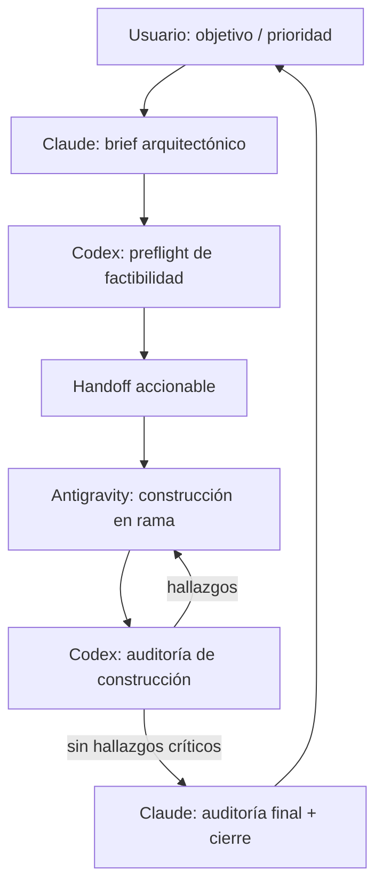

# Sugerencias Codex

- **Fecha:** 2026-06-01
- **Autor:** Codex
- **Documento base analizado:** `docs/Gobernanza/analisis_antigravity.md`
- **Contexto adicional revisado:** último reporte de sesión, `docs/_coordinacion/ESTADO.md`,
  auditoría maestra de gobernanza y tarjetas pendientes del Kanban.

Este documento no reemplaza el análisis de Antigravity. Lo complementa desde una mirada de
auditoría: qué está bien encaminado, dónde falta precisión operativa y cómo convertir la
gobernanza multiagente en un flujo más confiable, medible y barato en tokens.

---

## 1. Diagnóstico breve del análisis de Antigravity

El análisis de Antigravity acierta en lo central: separa arquitectura, construcción y auditoría;
identifica riesgos reales del proyecto; propone locks explícitos; y ordena la documentación como
memoria compartida para modelos de IA.

Lo que falta no es más intención, sino más contrato operativo. Hoy el documento explica quién
debería hacer qué, pero todavía deja zonas grises: cuándo un agente puede bloquear un cambio,
qué evidencia mínima debe dejar cada fase, cómo se evita que Claude y Codex auditen lo mismo,
cuándo una tarjeta está lista para construir, y qué se lee al iniciar sin caer en la orden cara de
"leer todos los documentos".

### Fortalezas que conviene conservar

- **La tríada de roles es correcta:** Claude como arquitecto y cierre, Antigravity como builder,
  Codex como auditor intermedio.
- **Los P0 elegidos son razonables:** backups, seed idempotente, Redis para rate-limit y branch
  protection están bien priorizados.
- **El lock en `docs/_coordinacion/ESTADO.md` es necesario:** ya hubo colisiones reales de
  working tree, así que no es burocracia decorativa.
- **La documentación viva separada del historial es buena dirección:** Kanban, reportes y
  coordinación cumplen funciones distintas.

### Puntos que mejoraría

- **Codex debería auditar antes y después de construir.** Si Codex solo aparece al final, detecta
  bugs tarde. La mejor posición es doble: preflight liviano sobre la especificación y auditoría
  fuerte sobre el diff.
- **Claude final no debe duplicar a Codex.** Codex valida construcción, pruebas, queries, migraciones
  y coherencia del diff. Claude cierra producto, arquitectura, seguridad transversal, accesibilidad
  y decisión de merge.
- **"Leer todos los documentos" no debe ser el protocolo normal.** Es caro y aumenta ruido. El
  protocolo debe ser: índice vivo + último reporte + `ESTADO.md` + tarjeta activa + fuentes
  explícitas citadas por la tarjeta.
- **Los P0 necesitan tarjetas propias.** Si quedan solo dentro de un documento estratégico, no se
  ejecutan. Cada P0 debe convertirse en una tarjeta pequeña con dueño, evidencia y criterios de
  aceptación.
- **El lock necesita reglas de expiración y granularidad.** Un lock sin TTL puede dejar el repo
  bloqueado por accidente. Un lock demasiado amplio frena trabajo paralelo legítimo.
- **Los enlaces `file:///` no son ideales para documentación versionada.** En docs del repo conviene
  usar rutas relativas portables. Los enlaces absolutos/clickables pueden usarse en respuestas de
  la app, pero no como contrato persistente del proyecto.

---

## 2. Flujo óptimo Claude + Antigravity + Codex

La ruta óptima no es una cadena rígida, sino una secuencia con gates claros. Cada agente aporta en
el punto donde reduce más riesgo.

### 2.1. Modelo recomendado



### 2.2. Responsabilidades por fase

| Fase | Responsable | Producto mínimo | Gate de salida |
| --- | --- | --- | --- |
| Intención | Usuario | Objetivo, prioridad y restricciones | El alcance se entiende en una frase |
| Arquitectura | Claude | Handoff con criterios de aceptación | Hay rutas probables, riesgos y no objetivos |
| Preflight | Codex | Observaciones sobre factibilidad, tests, datos, queries y docs | No hay contradicciones obvias con el código real |
| Construcción | Antigravity | Rama, implementación, tests actualizados | Barrera local verde y diff acotado |
| Auditoría de construcción | Codex | Hallazgos ordenados por severidad o aprobación técnica | Sin bugs P0/P1 abiertos |
| Cierre | Claude | Auditoría final, merge, reporte, liberación de locks | `main` verde y memoria actualizada |

### 2.3. Qué debe auditar Codex

Codex no debería limitarse a correr tests. Su valor está en hacer incómodas las preguntas que
protegen el proyecto:

- **Contrato vs. diff:** lo implementado coincide con el handoff, sin cambios laterales.
- **Datos y migraciones:** no hay pérdida de datos, migraciones peligrosas sin rollback ni seeds
  que pisen contenido curado.
- **Consultas:** no aparecen N+1, conteos inconsistentes ni queries dentro de loops.
- **Tests:** cubren la regla nueva y el caso de borde que podría romper producción.
- **Deploy:** `check --deploy`, variables necesarias y compatibilidad con Railway.
- **Frontend:** estados vacíos, accesibilidad básica, cache-buster si cambia CSS y no regresión
  obvia de layout.
- **Documentación:** la tarjeta movida por Kanban refleja lo hecho, y el reporte no mezcla planes
  con hechos cerrados.

### 2.4. Qué debe quedar para Claude al final

Claude debería cerrar lo que exige criterio global:

- Coherencia del cambio con la visión pedagógica y comercial.
- Revisión de seguridad transversal si toca auth, permisos, webhooks, settings o datos sensibles.
- Accesibilidad y performance como experiencia, no solo como checklist.
- Decisión de merge y redacción del reporte final.
- Conversión de hallazgos no bloqueantes en tarjetas de backlog.

### 2.5. Protocolo de locks mejorado

El lock actual es buena base, pero conviene especificarlo así:

- **Lock de escritura, no de lectura:** otros agentes pueden leer y auditar, pero no editar el
  mismo working tree mientras el lock esté tomado.
- **Lock por rama y objetivo:** si hay worktrees separados, se puede trabajar en paralelo; si es el
  mismo working tree, no.
- **TTL sugerido:** si un lock no se actualiza en 2 horas y el agente no está activo, otro agente
  puede marcarlo como "posible lock vencido" antes de tomarlo.
- **Handoff obligatorio al ceder:** el agente que suelta el lock deja una línea con rama, estado,
  comandos corridos, pendientes y archivos tocados.
- **No mezclar locks con decisiones:** `ESTADO.md` es vivo y corto. Las decisiones duraderas van
  a gobernanza o ADRs.

---

## 3. Plan profesional de consolidación de proyectos

La mejora principal es dejar de ordenar el proyecto como una sola lista larga. ProfeOnline tiene
cinco carteras distintas, cada una con métricas y riesgos propios.

### 3.1. Carteras recomendadas

| Cartera | Objetivo | Ejemplos |
| --- | --- | --- |
| Continuidad operacional | Evitar caída, pérdida de datos o deploy inseguro | Backups, seed idempotente, Redis, branch protection, staging |
| Calidad educativa STEM | Mejorar aprendizaje real | Scaffolding, KaTeX, feedback por distractor, skill tree |
| Conversión y confianza | Convertir visitantes en alumnos/contactos | Home, analytics, WhatsApp, verificación de email |
| Calidad de ingeniería | Reducir regresiones y fricción de mantenimiento | Coverage, Playwright, ruff, release tags, PR templates |
| Retención y gamificación | Aumentar hábito y retorno | Rachas, notificaciones, dashboard, leaderboards |

### 3.2. Priorización refinada

#### P0 - Crítico

Estos elementos protegen datos, despliegue y control del repositorio. Deben transformarse en
tarjetas Kanban antes de iniciar nuevas features grandes.

| Iniciativa | Por qué es crítica | Evidencia de cierre |
| --- | --- | --- |
| Backups + drill de restauración | Sin restore probado, el contenido y progreso de alumnos están en riesgo | Restore documentado en entorno de prueba |
| Idempotencia de `seed_math_resources` | Corre en deploy; si pisa o duplica datos, el daño puede ser silencioso | Test o auditoría del comando + reglas de no sobrescritura |
| `REDIS_URL` para rate-limit compartido | Sin cache compartida, el rate-limit por worker da falsa seguridad | Producción usando Redis y prueba de contador compartido |
| Branch protection | Hace obligatorio el flujo que hoy depende de disciplina humana | `main` requiere CI verde y review |
| Tarjetas P0 explícitas | La estrategia sin tarjeta no entra al flujo real | P0 creados en `docs/1 Por iniciar/` |

#### P1 - Necesario

Estos elementos mejoran la calidad real del producto y reducen regresiones frecuentes.

| Iniciativa | Comentario Codex | Orden sugerido |
| --- | --- | --- |
| Staging / preview deploys | Es el desbloqueador de QA serio antes de producción | Primero entre P1 |
| QA accesibilidad/rendimiento UI gamificada | Ya existe tarjeta y cubre una deuda concreta | Hacer tras staging o con producción logueada |
| Coverage + smoke tests Playwright | No basta la suite Django para JS, HTMX y flujos críticos | Después de staging |
| KaTeX | Producto STEM sin fórmulas renderizadas tiene techo pedagógico | Antes de expandir contenido científico |
| Scaffolding por prerequisitos | Hace que la gamificación enseñe en secuencia, no solo premie clicks | Después de estabilizar tests |
| Verificación de email | Seguridad/producto de bajo riesgo porque Brevo ya funciona | Puede ir en paralelo si no toca UI grande |
| Analytics fase 1 | Definir eventos antes de rediseñar o "optimizar" | Antes del rediseño del home |

#### P2 - Recomendado

Estos aumentan eficiencia, observabilidad y producto, pero no deberían desplazar los P0/P1.

| Iniciativa | Motivo |
| --- | --- |
| Dashboard interno con `XPEvent` / `QuizAttempt` | Usa datos existentes y evita depender de terceros para métricas educativas |
| Rachas visibles + notificaciones Brevo | Mejora retención si ya está medida |
| Ruff en pre-commit y CI | Retorno alto con bajo costo, siempre que se mantenga rápido |
| Release tags + changelog | Mejora rollback, trazabilidad y lectura histórica |
| Home de confianza | Importante, pero bloqueado por contenido real y medición previa |
| Confirmar pooler de DB | Necesario antes de escalar workers o tráfico |

#### P3 - Opcional

Deseables, pero solo después de consolidar medición, staging y base pedagógica.

| Iniciativa | Condición para abordarla |
| --- | --- |
| Skill tree visual avanzado | Primero tener prerequisitos y progreso confiables |
| Pizarra/canvas en quizzes | Primero validar demanda móvil y flujos de quiz |
| Leaderboards / ligas | Primero asegurar que la competencia no distorsione aprendizaje |
| Feedback por distractor avanzado | Primero normalizar datos de preguntas y explicaciones |

### 3.3. Secuencia recomendada

1. **Semana 1:** crear tarjetas P0, activar branch protection, verificar backups, auditar seed y
   definir Redis.
2. **Semanas 2-3:** staging/preview deploys, QA de UI gamificada, coverage inicial y smoke tests.
3. **Mes 1:** verificación de email, analytics fase 1 y KaTeX con alcance acotado.
4. **Mes 2:** scaffolding de niveles, dashboard interno mínimo y preparación del home con contenido
   real.
5. **Después:** skill tree, rachas avanzadas, notificaciones, canvas o ligas según datos de uso.

### 3.4. Regla de decisión para nuevas ideas

Toda idea nueva debe clasificarse antes de construir:

- **Crítico:** evita pérdida de datos, caída, bypass de seguridad o deploy roto.
- **Necesario:** sostiene aprendizaje, conversión, QA o una operación frecuente.
- **Recomendado:** mejora eficiencia, retención o mantenibilidad sin bloquear lo anterior.
- **Opcional:** aporta diferenciación, pero puede esperar sin aumentar riesgo.

Si una idea no tiene métrica, dueño, criterio de aceptación y evidencia de cierre, todavía no está
lista para construcción.

---

## 4. Documentación: cómo ordenarla para que las IA la usen bien

La documentación actual ya es valiosa, pero puede volverse cara si cada agente intenta leer todo.
La solución es tener pocos documentos canónicos y muchos documentos históricos bien archivados.

### 4.1. Problema actual

- Hay documentos estratégicos, auditorías, reportes y tarjetas mezclando niveles de abstracción.
- Existen dos lugares conceptuales para auditorías: `docs/Auditorias/` y auditorías archivadas en
  `docs/3 Finalizados/`.
- El reporte diario puede crecer mucho cuando varias sesiones ocurren el mismo día.
- Las estrategias P0/P1 aparecen en documentos largos, pero no todas existen como tarjetas
  ejecutables.

### 4.2. Taxonomía recomendada

```text
docs/
├── 00-LEER-PRIMERO.md
├── 1 Por iniciar/
├── 2 En Proceso/
├── 3 Finalizados/
├── 4 Reportes por Sesión/
├── Gobernanza/
│   ├── proceso-multiagente.md
│   ├── roadmap-priorizado.md
│   ├── matriz-riesgos.md
│   ├── inventario-operacional.md
│   └── decisiones/
│       └── ADR-0001-ejemplo.md
├── Auditorias/
│   ├── README.md
│   └── 2026-06-01-gamificacion-malla.md
└── _coordinacion/
    ├── ESTADO.md
    ├── handoffs/
    └── bitacora/
```

### 4.3. Qué vive en cada lugar

| Lugar | Vive aquí | No vive aquí |
| --- | --- | --- |
| `00-LEER-PRIMERO.md` | Índice corto: qué leer según tarea | Historia completa |
| `1 Por iniciar/` | Tareas futuras accionables | Ensayos estratégicos largos |
| `2 En Proceso/` | Una tarea activa por archivo | Reportes generales |
| `3 Finalizados/` | Tarjetas cerradas con "Qué se hizo" | Políticas vigentes |
| `4 Reportes por Sesión/` | Memoria cronológica de sesiones | Specs activas |
| `Gobernanza/` | Reglas vigentes, roadmap, riesgos, decisiones | Auditorías vencidas sin estado |
| `Auditorias/` | Auditorías por fecha, alcance y estado | Tarjetas de ejecución |
| `_coordinacion/` | Locks, handoffs y bitácora viva | Conocimiento permanente |

### 4.4. Protocolo barato de lectura para IA

Al iniciar una sesión, leer solo:

1. `docs/00-LEER-PRIMERO.md` o índice equivalente si existe.
2. `docs/_coordinacion/ESTADO.md`.
3. Último reporte en `docs/4 Reportes por Sesión/`.
4. Tarjeta Kanban activa o documento que pidió el usuario.
5. Archivos de código o docs citados explícitamente por esa tarjeta.

Solo se lee "todo" cuando el usuario pida una auditoría global o cuando el índice esté roto.

### 4.5. Formato recomendado para tarjetas

Cada tarjeta debería tener siempre:

- **Objetivo en una frase.**
- **Prioridad:** P0/P1/P2/P3 y justificación.
- **Tipo:** infraestructura, producto, pedagogía, seguridad, QA, documentación.
- **Dueño sugerido:** Claude, Antigravity, Codex o Usuario.
- **Fuentes a leer:** rutas concretas.
- **No objetivos:** qué queda fuera.
- **Criterios de aceptación verificables.**
- **Plan de pruebas.**
- **Riesgos y rollback.**
- **Qué se hizo:** completar al cerrar.

### 4.6. Formato recomendado para handoffs

Los handoffs deben ser más contractuales que narrativos:

- Contexto mínimo.
- Archivos probables a tocar.
- Cambios esperados.
- Casos de borde.
- Tests mínimos.
- Riesgos de performance, seguridad, accesibilidad o datos.
- Qué no debe cambiarse.
- Evidencia que el builder debe entregar.
- Checklist para Codex auditor.
- Checklist para Claude cierre.

### 4.7. Decisiones duraderas como ADR

Las decisiones que cambian arquitectura o producto no deberían quedar enterradas en reportes. Usar
ADRs pequeños:

```text
docs/Gobernanza/decisiones/ADR-0001-render-matematico-katex.md
```

Formato:

- Estado: propuesto, aceptado, reemplazado.
- Contexto.
- Decisión.
- Alternativas consideradas.
- Consecuencias.
- Fecha y responsable.

---

## 5. Recomendaciones concretas de Codex

1. **Crear `docs/00-LEER-PRIMERO.md`.** Debe ser el mapa de lectura para agentes. Máximo 80-120
   líneas.
2. **Convertir los P0 en tarjetas Kanban.** Backups, seed, Redis y branch protection no deben
   vivir solo en gobernanza.
3. **Añadir preflight Codex al flujo.** Cinco minutos de auditoría sobre el handoff pueden ahorrar
   horas de implementación mal orientada.
4. **Definir `Definition of Ready` y `Definition of Done`.** Ready para construir; Done para
   auditar; Closed para mergear.
5. **Separar auditoría técnica de auditoría final.** Codex no decide producto; Claude no necesita
   repetir cada query si Codex ya dejó evidencia.
6. **Unificar auditorías.** Elegir una sola ubicación canónica para auditorías recurrentes y dejar
   lo archivado como histórico.
7. **No construir el home sin contenido real.** La tarjeta del home es valiosa, pero sin foto, bio,
   prueba social y analítica previa se corre el riesgo de solo embellecer un supuesto.
8. **Priorizar staging antes de más UI sensible.** Si el proyecto seguirá creciendo en experiencia
   visual, el QA contra producción ya no escala.
9. **Crear una plantilla de PR.** Debe incluir comandos corridos, cache-buster, migraciones,
   screenshots o QA manual cuando aplique, y vínculo a tarjeta.
10. **Mantener `_coordinacion/` liviano.** Si crece demasiado, deja de ser canal vivo y se convierte
    en otro archivo histórico caro de leer.

---

## 6. Ruta óptima inmediata

Si hubiera que elegir solo el próximo movimiento, mi recomendación es esta:

1. Crear el índice `docs/00-LEER-PRIMERO.md`.
2. Crear tarjetas P0 para backups, seed idempotente, Redis y branch protection.
3. Adoptar formalmente el gate de preflight Codex antes de construcción.
4. Ejecutar P0 operacionales.
5. Montar staging.
6. Recién después, retomar features de producto grandes como home, skill tree o rachas avanzadas.

La idea no es frenar el producto. Es evitar que el producto avance sobre una base operacional que
todavía tiene puntos de fallo evitables.
