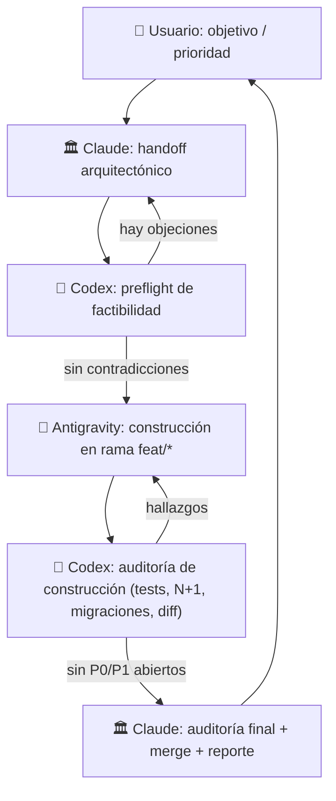

# Proceso multiagente — roles, flujo y coordinación

> Documento **canónico** (Capa 1). Funde la tríada propuesta por Claude, Antigravity y Codex en una
> sola fuente de verdad. Insumos originales en [`_fuentes/`](_fuentes/).
> Última revisión: 2026-06-01.

## 1. Roles

| Rol | Agente | Hace | NO hace |
| --- | --- | --- | --- |
| 🏛️ **Arquitecto + Cierre** | **Claude** | Diseña specs/handoffs y criterios de aceptación; decide arquitectura, pedagogía y seguridad transversal; **revisa el plan del builder antes de construir**; auditoría final; `squash-merge` a `main`; escribe el reporte de sesión. | No escribe el grueso del código de features (lo delega al builder). No repite la auditoría técnica que ya hizo Codex. |
| 🔨 **Constructor (Builder)** | **Antigravity** | Implementa la spec en una rama `feat/*`; CSS externo (sin inline) + HTML; lógica Django + tests; deja la barrera local verde; completa "Qué se hizo" en la tarjeta. | No mergea a `main`. No cambia el alcance sin aprobación. No edita docs históricos (solo su tarjeta en `3-construccion/`). |
| 🧩 **Auditor (preflight + construcción)** | **Codex** | **Preflight**: revisa el handoff vs. el código real antes de construir (factibilidad, datos, queries). **Auditoría de construcción**: corre la suite, caza N+1, valida migraciones, `check --deploy`, formato/linter, contraste diff vs. handoff. Apoya integraciones/datos (webhook, import YouTube). | No inicia construcción masiva. No mergea. No decide producto (eso es de Claude). |
| 🧑 **Decisión + QA humano** | **Usuario** | Aprueba, hace QA visual/teclado/NVDA, gestiona servicios y secretos (Railway, DNS, Brevo), decide producto. | — |

## 2. Flujo con gates

### Responsabilidades por fase y gate de salida

| Fase | Responsable | Producto mínimo | Gate para avanzar |
| --- | --- | --- | --- |
| Intención | 🧑 Usuario | Objetivo, prioridad, restricciones | El alcance se entiende en una frase |
| Arquitectura | 🏛️ Claude | Handoff con criterios de aceptación | Hay rutas probables, riesgos y no-objetivos |
| Preflight | 🧩 Codex | Observaciones de factibilidad/datos/queries | Sin contradicciones obvias con el código real |
| Construcción | 🔨 Antigravity | Rama + implementación + tests | Barrera local verde y diff acotado |
| Auditoría de construcción | 🧩 Codex | Hallazgos por severidad o aprobación técnica | Sin bugs P0/P1 abiertos |
| Cierre | 🏛️ Claude | Auditoría final, merge, reporte, locks liberados | `main` verde y memoria actualizada |

### Kanban por etapas (cada columna = dueño activo)

Cada fase tiene una **carpeta** en [`../backlog/`](../backlog/). La IA dueña de la etapa trabaja la
tarjeta y, al pasar su gate, la mueve con `git mv` a la siguiente. La **carpeta** dice "¿en qué fase
va?"; el **lock** en `_coordinacion/ESTADO.md` dice "¿quién toca el árbol ahora?".

| Carpeta | Dueño | Sale (con `git mv`) cuando… |
| --- | --- | --- |
| `1-por-iniciar/` | — (backlog) | 🏛️ Claude toma la idea → `2-arquitectura/` |
| `2-arquitectura/` | 🏛️ Claude (+ 🧩 preflight) | handoff **Ready** y Codex no objetó → `3-construccion/` |
| `3-construccion/` | 🔨 Antigravity | **Done**: barrera verde + diff acotado → `4-auditoria/` |
| `4-auditoria/` | 🧩 Codex | sin hallazgos P0/P1 → `5-cierre/` (si los hay, **vuelve** a `3-construccion/`) |
| `5-cierre/` | 🏛️ Claude (+ 🧑 QA) | auditoría final OK y `squash-merge` a `main` → `6-finalizados/` |
| `6-finalizados/` | — (histórico) | — |

> En una sesión donde una IA cubre varias fases puede mover la tarjeta varias carpetas seguidas;
> cada `git mv` es la señal de handoff. Un rechazo en `4-auditoria/` hace **retroceder** la tarjeta
> a `3-construccion/` con los hallazgos anotados.

## 3. Definición de Ready / Done / Closed

- **Ready (lista para construir):** la tarjeta tiene objetivo en una frase, prioridad (P0–P3),
  tipo, dueño sugerido, fuentes a leer, no-objetivos, criterios de aceptación verificables, plan de
  pruebas y riesgos/rollback. Si falta algo, **todavía no se construye**.
- **Done (lista para auditar):** barrera verde (`test` + `check` + `makemigrations --check`), diff
  acotado al handoff, cache-buster `?v=N` subido si tocó CSS, "Qué se hizo" completado.
- **Closed (integrada):** CI del PR verde, auditoría final sin hallazgos abiertos, `squash-merge` a
  `main`, tarjeta movida a `6-finalizados/`, reporte escrito.

## 4. Coordinación: locks y handoffs (canal vivo en `_coordinacion/`)

El problema real ya ocurrió: dos agentes editaron el mismo working tree y se pisaron. Protocolo:

1. **Lock de escritura** en `_coordinacion/ESTADO.md` antes de tocar el árbol: nombre + rama + hora.
   Otros pueden **leer/auditar**, pero no **editar** el mismo working tree mientras el lock esté
   tomado.
2. **Lock por rama y objetivo.** Con worktrees separados se puede trabajar en paralelo; en el
   **mismo** working tree, no.
3. **TTL ~2 h.** Si un lock no se actualiza en 2 h y el agente no está activo, otro puede marcarlo
   como "posible lock vencido" antes de tomarlo.
4. **Handoff al ceder:** quien suelta el lock deja una línea con rama, estado, comandos corridos,
   pendientes y archivos tocados.
5. **`ESTADO.md` es corto y vivo.** Las decisiones duraderas NO van ahí: van a un ADR
   (`decisiones/`) o a `gobernanza/`.

## 5. Git y PRs

- Flujo: rama (`feat/*`, `fix/*`, `docs/*`) → push → PR a `main` → CI verde → `squash-merge` →
  borrar rama. **Nunca** push directo a `main` (ver branch protection en `roadmap-priorizado.md`).
- **Mover archivos siempre con `git mv`** (conserva historial).
- Cada PR debería declarar: comandos corridos, cache-buster, migraciones, QA manual si aplica, y el
  enlace a la tarjeta. (Plantilla de PR pendiente — ver roadmap P1.)

## 6. Economía de tokens (resumen; regla completa en `CLAUDE.md`/`AGENTS.md`)

Búsquedas acotadas; leer antes de editar el fragmento exacto; no re-leer lo ya leído; avisar antes
de operaciones caras; **seguir el protocolo barato de lectura** del [`README`](../README.md) en vez
de "leer todo".
